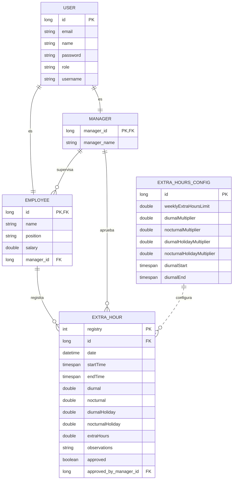

# Diagrama de Entidad Relación del Sistema de Administración de Horas Extra

Este es el diagrama de entidad relación que representa el sistema de administración de horas extra. A continuación, se explica las entidades y sus relaciones:

1. **MANAGER**: Almacena información de los gerentes con un ID único y nombre.
2. **EMPLOYEE**: Contiene datos de los empleados, incluyendo nombre, posición y salario. Cada empleado puede tener un gerente asignado (relación con MANAGER).
3. **EXTRA_HOUR**: Registra las horas extra trabajadas por un empleado, con información como fecha, hora de inicio y fin, diferentes tipos de horas (diurnas, nocturnas, en días festivos), observaciones y estado de aprobación.
4. **EXTRA_HOURS_CONFIG**: Contiene la configuración del sistema para el cálculo de horas extra, incluyendo límites semanales, multiplicadores para diferentes tipos de horas y rangos horarios.
5. **USER**: Almacena información de usuarios del sistema, como credenciales, roles y datos personales.

Relaciones principales:

- User es la entidad base para MANAGER y EMPLOYEE (1:1)
- Un gerente puede supervisar a muchos empleados (1:N)
- Un gerente puede aprobar a muchas horas extra (1:N)
- Un empleado puede registrar muchas horas extra (1:N)
- La configuración de horas extra se aplica a todos los registros de horas extra (1:N)

